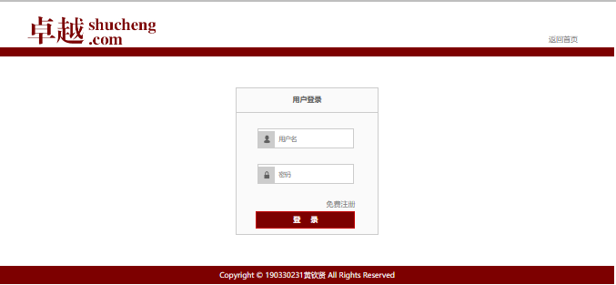
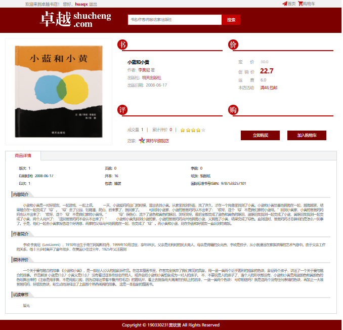
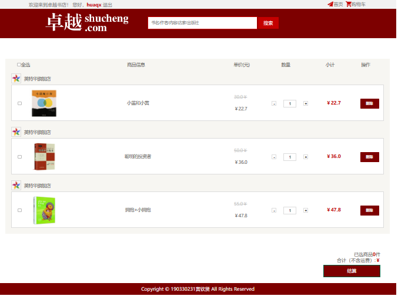
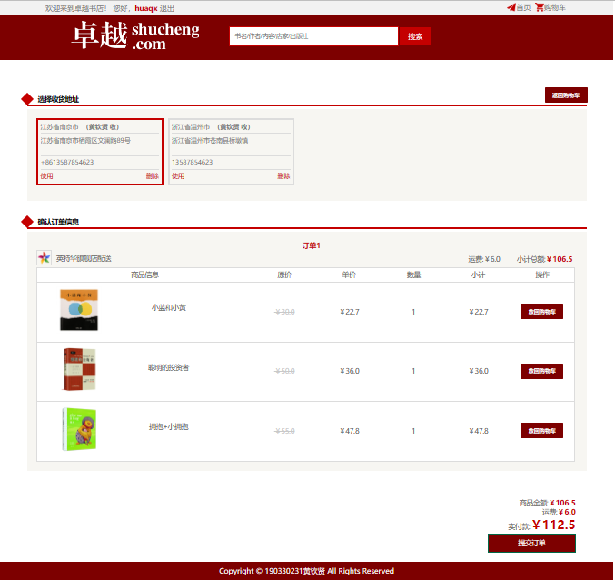
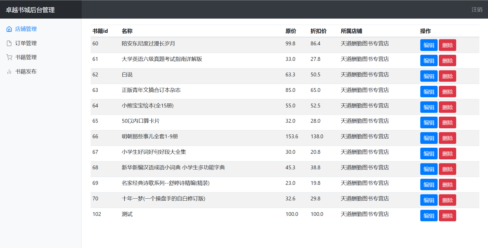

## 基于JavaEE的网上书城系统

### 使用说明

导入项目中的sql文件到本地的数据库，修改配置文件中的数据库的用户名和密码为自己本地的数据库用户名和密码，Maven最后导入相关的依赖即可运行。

默认首要地址为：    http://localhost:8080/index

默认后台管理系统登录界面：    http://localhost:8080/manger/login

### 实现功能

#### 前台

- [x] 登陆注册模块：为用户的登陆注册提供支持
- [x] 书籍检索模块：提供按照书籍类别和关键字检索两种方式
- [x] 购物车模块：登陆后的用户可以将心仪的商品加入购物车之后统一下单同时提供对购物车中商品的管理
- [x] 个人信息模块：方便用户对个人信息，收货 地址，订单信息等 进行查看和管理
- [x] 订单结算模块：对用户提交的订单进行费用的结算

#### 后台

- [x] 登陆模块：为用户的登陆提供支持
- [x] 店铺信息管理模块：管理店铺的常规信息
- [x] 订单管理模块：查看订单信息
- [x] 书籍管理模块：查看书籍信息添加书籍

### 技术栈

#### 后端

* 核心框架：SpringBoot
* 持久层框架：MyBatis
* 模板框架：Thymeleaf
* 数据库：Mysql

#### 前端

* JS框架：Jquery
* CSS框架：Bootstrap

### 目录结构

```js
.
├─src
│  ├─main
│  │  ├─java
│  │  │  └─com
│  │  │      └─huaqx
│  │  │          ├─common  分页工具
│  │  │          ├─config  配置文件
│  │  │          ├─controller 控制层
│  │  │          ├─mapper 数据访问层
│  │  │          ├─pojo   数据实体类
│  │  │          ├─service 服务层
│  │  │          └─util  工具类
│  │  └─resources
│  │      ├─mybatis
│  │      │  └─mapper sql语句对应mapper层
│  │      ├─sql  数据库文件
│  │      ├─static
│  │      │  ├─css  css文件以及图片
│  │      │  │  └─images
│  │      │  ├─images 图片
│  │      │  │  ├─advers
│  │      │  │  ├─avatars
│  │      │  │  ├─books
│  │      │  │  └─shopicons
│  │      │  ├─img 上传图片
│  │      │  └─js  js文件
│  │      │      ├─jquery
│  │      │      ├─plugin
│  │      │      └─pro_city_town
│  │      └─templates 页面文件
│  │          └─layouts
│  └─test 单元测试类
│      └─java
│          └─com
│              └─huaqx
└─target
    ├─classes
    │  ├─com
    │  │  └─huaqx
    │  │      ├─common
    │  │      ├─config
    │  │      ├─controller
    │  │      ├─mapper
    │  │      ├─pojo
    │  │      ├─service
    │  │      └─util
    │  ├─mybatis
    │  │  └─mapper
    │  ├─static
    │  │  ├─css
    │  │  │  └─images
    │  │  ├─images
    │  │  │  ├─advers
    │  │  │  ├─avatars
    │  │  │  ├─books
    │  │  │  └─shopicons
    │  │  ├─img
    │  │  └─js
    │  │      ├─jquery
    │  │      ├─plugin
    │  │      └─pro_city_town
    │  └─templates
    │      └─layouts
    └─test-classes
        └─com
            └─huaqx
```

### 图片演示

#### 前台

> 网站主页

 

> 网站登录界面

 

> 网站搜索界面

 

> 书籍详情界面

 

> 购物车界面

 

> 订单提交界面

 

#### 后台

> 后台登录界面

 

> 后台管理界面

 
